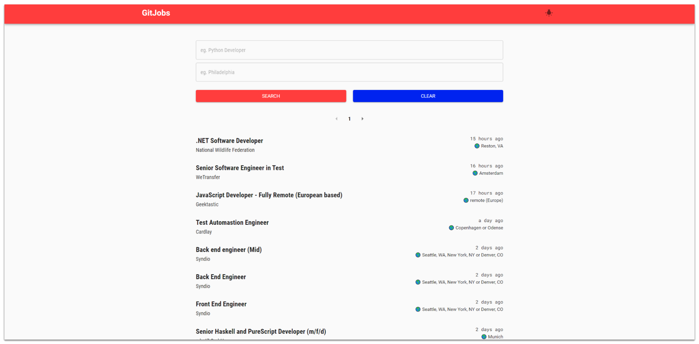
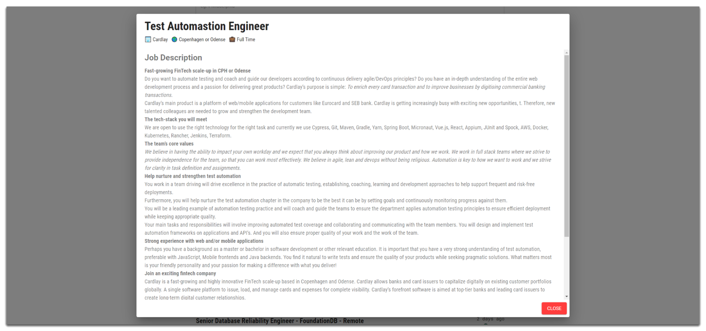

<h1>GitJobs 🏢</h1>

Find your dream job today ⛅

### Features 🎨

- **🔎 Search Jobs**: User can search jobs by job title and/or location
- **📝 Job Description**: User are able to see job description that companies posted

### Technologies 🔨

- **🌐 React JS**: Front End
- **⚡ Redux**: State Management
- **🍿 [GitHub Job API](https://jobs.github.com/api)**: API to fetch the data

### Developed by [Khem Sok](https://github.com/khemsok) 🧐

Thanks For Reading!
